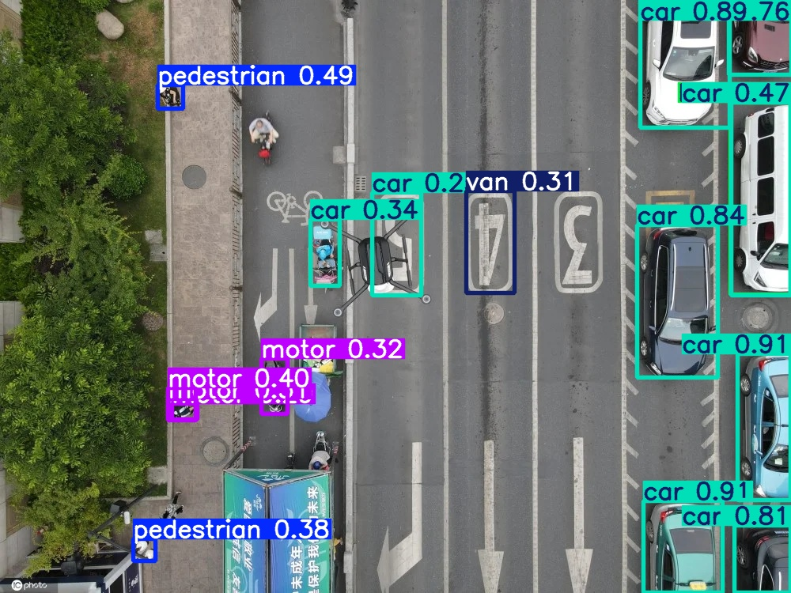
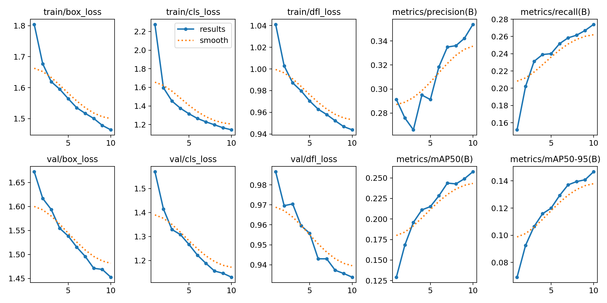
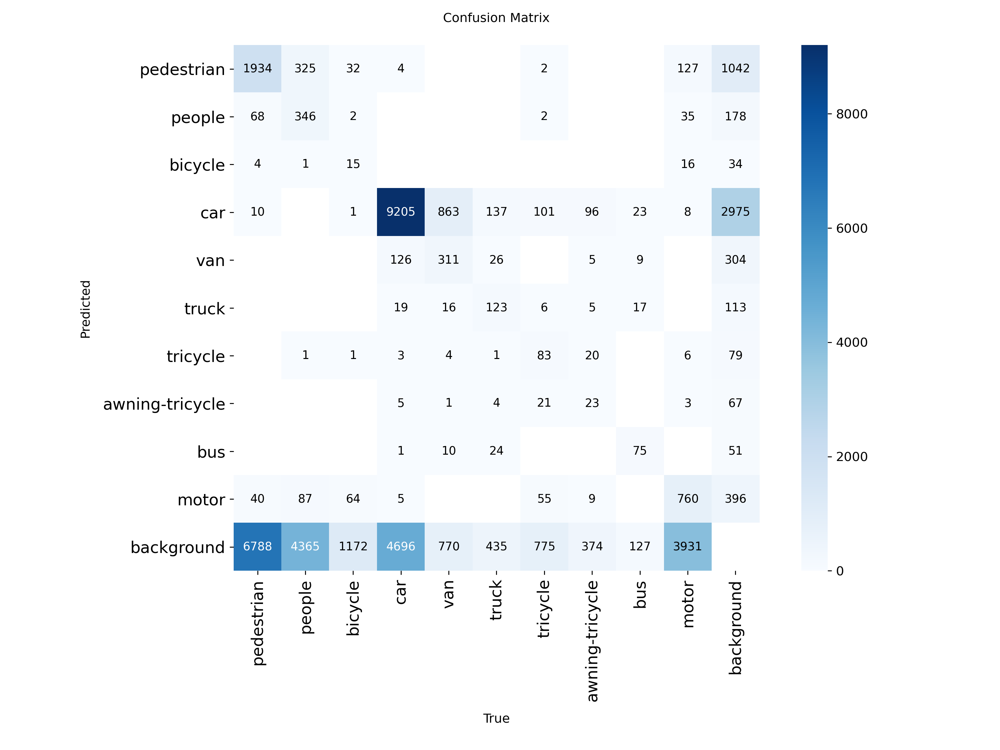
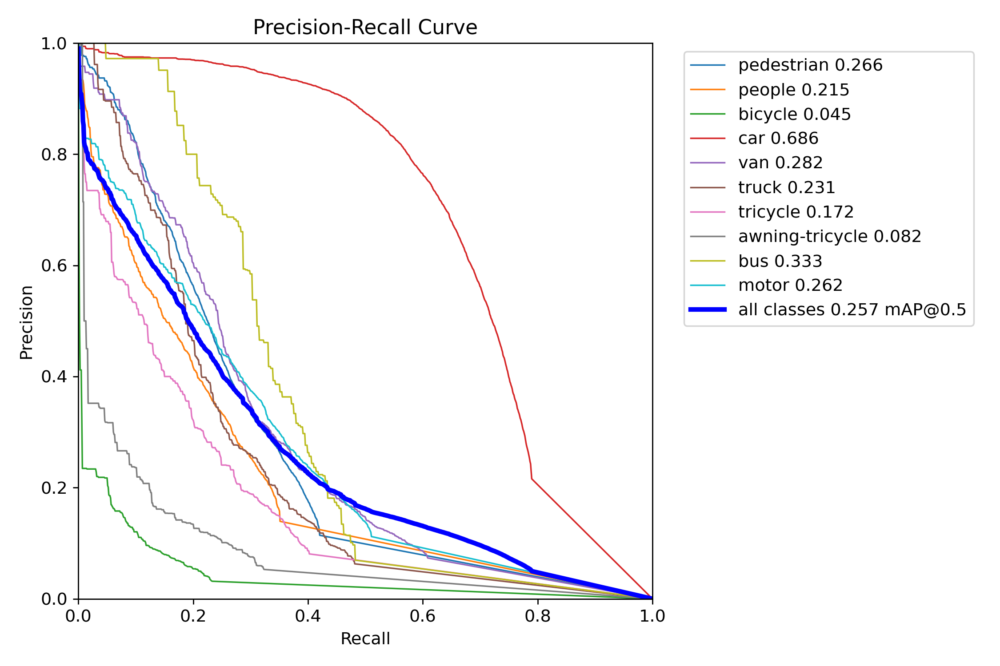

# Harness & Loop Engineering for Drone Object Detection

[](https://github.com/ranrango/harness-loop-engineering/actions/workflows/ci.yml)
[](https://github.com/ranrango/harness-loop-engineering/releases/tag/v0.1.0)
[](https://www.python.org/)
[](LICENSE)
[](https://github.com/ultralytics/ultralytics)

本仓库把 **Harness Engineering（驾驭工程）** 与 **Loop Engineering（循环工程）** 的方法论，落到一个可运行、可测试、可复现的无人机目标检测项目中。

- 概念层：系统整理 AI 应用中的 Harness/Loop 设计方法、组件和行业实践。
- 工程层：基于 VisDrone2019-DET 与 YOLOv8n 构建小目标检测基线。
- 闭环层：用配置化实验、数据审计、训练、验证、指标门槛和报告生成形成可重复迭代流程。

本仓库只包含源代码、配置文件、示例结果和复现文档。数据集、训练输出、模型权重和凭据文件均不纳入版本控制。

## 快速入口

| 入口 | 说明 |
|---|---|
| [v0.1.0 Release](https://github.com/ranrango/harness-loop-engineering/releases/tag/v0.1.0) | 当前公开发布版本 |
| [Harness/Loop 使用说明](docs/harness_loop.md) | 数据审计、指标门槛、runner 和报告工作流 |
| [实践手册](PRACTICAL_GUIDE.md) | Harness/Loop 方法论从概念到落地 |
| [复现指南](docs/reproducibility.md) | VisDrone + YOLOv8n 基线复现步骤 |
| [Publication Checklist](PUBLICATION_CHECKLIST.md) | 发布安全边界和验证记录 |

---

## 什么是 Harness 与 Loop？

| | Harness Engineering | Loop Engineering |
|---|---|---|
| 中文 | 驾驭工程 | 循环工程 |
| 核心问题 | 如何让模型/系统可控、可预测地完成任务 | 如何构建感知、决策、行动、反馈的迭代闭环 |
| 关键词 | Prompt、Guardrails、Evals、RAG、Tool Use、指标门槛 | ReAct、Agent Loop、Human-in-the-Loop、监控、修复 |
| 在本项目中 | 配置、数据审计、训练/验证命令、质量门槛 | 每轮实验产物、指标比较、报告、下一步建议 |

Harness 是基础设施层，Loop 是迭代执行层。对于目标检测项目，它们对应的是：把数据、模型、训练、验证和报告变成可控管线，再用结果持续驱动下一轮实验。

---

## 目录结构

```text
harness-loop-engineering/
├── PRACTICAL_GUIDE.md          # 从概念到落地的实践手册
├── applications/               # 行业应用案例
├── harness/                    # 驾驭工程概念、组件、行业实践、示例
├── loop/                       # 循环工程概念、组件、行业实践、示例
├── configs/experiments/        # 检测实验配置
├── src/
│   ├── harness/                # 数据审计、指标检查、报告、runner
│   ├── detect.py               # drone-detect 入口
│   ├── train.py                # drone-train 入口
│   ├── val.py                  # drone-val 入口
│   └── utils.py
├── scripts/                    # VisDrone 标注转换脚本
├── tests/                      # 单元测试
├── docs/                       # 环境、复现、Harness/Loop 使用文档
├── assets/                     # README 展示用结果图
├── .github/workflows/ci.yml    # GitHub Actions：代码检查 + 测试
├── data.yaml                   # 数据集配置
├── pyproject.toml              # 包元数据、依赖、工具配置
└── Makefile                    # 快捷命令
```

---

## 快速导航

### Harness/Loop 方法论

| 章节 | 内容 |
|---|---|
| [实践手册](./PRACTICAL_GUIDE.md) | 如何把 Harness 与 Loop 落到真实 AI 应用 |
| [应用案例](./applications/) | 客服、代码、工业、研究等场景的组合设计 |
| [Harness 核心概念](./harness/01-concepts/) | 定义、起源、与传统工程的关系 |
| [Harness 核心组件](./harness/02-core-components/) | Prompt 工程、Guardrails、Evals、RAG、Tool Use |
| [Harness 工业实践](./harness/03-industry/) | 发展历程、各公司实践、前沿趋势 |
| [Harness 代码示例](./harness/04-examples/) | 可运行的工程实践示例 |
| [Loop 核心概念](./loop/01-concepts/) | Agent Loop 心智模型 |
| [Loop 核心组件](./loop/02-core-components/) | ReAct、Memory、Planning、Multi-Agent |
| [Loop 工业实践](./loop/03-industry/) | 发展历程、各公司实践、前沿趋势 |
| [Loop 代码示例](./loop/04-examples/) | 可运行的闭环示例 |

### 无人机检测工程

| 文档 | 内容 |
|---|---|
| [Harness/Loop 使用说明](docs/harness_loop.md) | 实验配置、数据审计、指标门槛、报告生成 |
| [环境配置](docs/environment.md) | Python、依赖和本地环境 |
| [复现指南](docs/reproducibility.md) | 从数据转换到训练验证的完整步骤 |
| [设计规格](docs/superpowers/specs/2026-07-04-harness-loop-engineering-design.zh.md) | 中文设计说明 |
| [实施计划](docs/superpowers/plans/2026-07-04-harness-loop-engineering.zh.md) | 中文实施计划 |

---

## 实验结果

基于 [VisDrone2019-DET](http://aiskyeye.com/) 数据集，使用 YOLOv8n 构建无人机航拍图像中的小目标检测基线。

| 指标 | 数值 |
|---|---:|
| 精确率（Precision） | 0.354 |
| 召回率（Recall） | 0.274 |
| **mAP@0.5** | **0.258** |
| mAP@0.5:0.95 | 0.147 |

基线配置：YOLOv8n · 10 epoch · batch=8 · imgsz=640 · CPU

<details>
<summary>逐类 AP@0.5</summary>

| 类别 | AP@0.5 |
|---|---:|
| 轿车 | 0.686 |
| 公交车 | 0.333 |
| 面包车 | 0.282 |
| 行人 | 0.266 |
| 摩托车 | 0.262 |
| 人群 | 0.215 |
| 卡车 | 0.231 |
| 三轮车 | 0.172 |
| 遮阳三轮车 | 0.082 |
| 自行车 | 0.045 |

</details>

样本推理结果：



训练曲线与评估图表：

| 训练指标曲线 | 混淆矩阵 |
|---|---|
|  |  |



---

## 快速开始

```bash
git clone https://github.com/ranrango/harness-loop-engineering
cd harness-loop-engineering
python3 -m venv .venv
source .venv/bin/activate
pip install -e .
```

下载 VisDrone2019-DET 数据集并放置到 `data/` 目录后，运行：

```bash
drone-convert
drone-train --epochs 10 --batch 8 --device cpu
drone-val --model runs/detect/train_<日期>_yolov8n_visdrone/weights/best.pt
drone-detect --model runs/detect/.../weights/best.pt --source 图片路径.jpg
```

也可以使用 Makefile：

```bash
make install-dev      # 安装项目及开发依赖
make test             # 运行单元测试
make convert          # 转换 VisDrone 标注
make train            # 10 epoch 基线训练
make val              # 验证最新权重
```

---

## Harness 与 Loop 工作流

默认实验配置位于 `configs/experiments/baseline_yolov8n.yaml`。

```bash
make audit            # 检查本地 VisDrone/YOLO 数据结构和标签质量
make harness-dry-run  # 打印完整闭环命令，不执行训练
make metrics-check    # 用 baseline 指标检查 gate
```

常用 CLI：

```bash
drone-audit-data --config configs/experiments/baseline_yolov8n.yaml
drone-run-harness --config configs/experiments/baseline_yolov8n.yaml --stage audit --dry-run
drone-check-metrics --config configs/experiments/baseline_yolov8n.yaml --metrics runs/.../metrics.json
drone-loop-report --config configs/experiments/baseline_yolov8n.yaml --run-dir runs/harness/<run_id>
```

闭环产物会写入 `runs/harness/<run_id>/`，包括数据审计、验证指标、gate 检查和 Markdown 报告。

---

## 隐私与发布边界

- 不提交真实 `.env`、API key、token、私钥或本机路径。
- 不提交 VisDrone 原始数据、训练输出、模型权重或导出的推理结果目录。
- `.env.example` 只保留空值占位；真实凭据只应存在于本地 shell、CI secrets 或未跟踪的 `.env` 文件中。
- 发布前使用 `PUBLICATION_CHECKLIST.md` 中的检查项确认公开仓库内容。

---

## 数据集

**VisDrone2019-DET** 是无人机视角下的 10 类目标检测数据集。请从 [VisDrone 官网](http://aiskyeye.com/) 下载并确认许可条款后使用。

下载并转换后的目录结构：

```text
data/
  VisDrone2019-DET-train/
    images/
    annotations/
    labels/
  VisDrone2019-DET-val/
    images/
    annotations/
    labels/
  VisDrone2019-DET-test/
    images/
```

目标类别：

| ID | 类别 | ID | 类别 |
|---:|---|---:|---|
| 0 | 行人 | 5 | 卡车 |
| 1 | 人群 | 6 | 三轮车 |
| 2 | 自行车 | 7 | 遮阳三轮车 |
| 3 | 轿车 | 8 | 公交车 |
| 4 | 面包车 | 9 | 摩托车 |

---

## 命令行工具

执行 `pip install -e .` 后，以下命令自动可用：

```text
drone-convert        转换 VisDrone 标注为 YOLO 格式
drone-train          训练 YOLOv8 检测模型
drone-val            验证模型并可输出 metrics.json
drone-detect         图片、目录或视频推理
drone-audit-data     数据集结构和标签质量审计
drone-check-metrics  指标门槛检查
drone-loop-report    生成单轮实验报告
drone-run-harness    编排 audit/train/val/gate/report 工作流
```

示例：

```bash
drone-detect --model best.pt --source image.jpg
drone-detect --model best.pt --source images/ --classes 3 4 8
drone-val --model best.pt --metrics-output runs/harness/baseline/metrics.json
```

---

## 开发

```bash
make test      # 单元测试
make lint      # ruff 检查
make format    # black 检查
black .
```

完整贡献说明见 [CONTRIBUTING.md](CONTRIBUTING.md)。

---

## 复现基线

完整步骤见 [docs/reproducibility.md](docs/reproducibility.md)。

```bash
make convert
make train
make val
```

验证输出示例：

```text
────────────────────────────────────────
  mAP@0.5      : 0.2576
  mAP@0.5:0.95 : 0.1468
  精确率       : 0.3538
  召回率       : 0.2740
────────────────────────────────────────
```

---

## 已知局限

- YOLOv8n 是最小变体；自行车、遮阳三轮车等小目标类别的 AP 较低。
- CPU 上仅跑 10 个 epoch；使用 GPU 并延长至 50-100 epoch 可显著提升 mAP。
- 当前使用 Ultralytics 默认增强策略，尚未针对小目标做专项优化。
- VisDrone 官方未公开测试集标注；本项目所有指标均基于 val 集。

---

## 许可证

本项目采用 [MIT 许可证](LICENSE)。

VisDrone2019-DET 数据集有独立许可证，使用前请查阅 [aiskyeye.com](http://aiskyeye.com/)。YOLOv8 预训练权重遵循 [Ultralytics 许可证](https://github.com/ultralytics/ultralytics/blob/main/LICENSE)。
